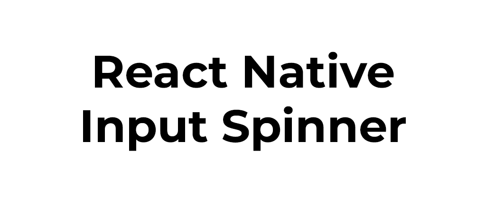

## 💡 Props List

| Property                | Description                                                                                                                    | Type             | Default          | Note                                             |
| ----------------------- | ------------------------------------------------------------------------------------------------------------------------------ | ---------------- | ---------------- | ------------------------------------------------ |
| `accelerationDelay`     | Delay time before start the `onLongPress` event and increase or decrease and continually                                       | Number           | `750 `           |                                                  |
| `activeOpacity`         | Opacity on pressed button                                                                                                      | Number           | `0.85`           |                                                  |
| `append`                | Custom element before right button                                                                                             | Component        |                  |                                                  |
| `arrows`                | Labels on button will be arrows (< and >) instead of plus and minus                                                            | Boolean          | `false`          |                                                  |
| `autoFocus`             | If `true`, focuses the input on `componentDidMount`.                                                                           |                  | `false`          |                                                  |
| `background`            | Background color of number button                                                                                              | String           | `transparent`    |                                                  |
| `buttonFontFamily`      | Custom fontFamily of buttons of the Spinner                                                                                    | String           | `System Default` |                                                  |
| `buttonFontSize`        | Custom fontSize of buttons of the Spinner                                                                                      | Number           | `14`             |                                                  |
| `buttonLeftDisabled`    | Disable left button                                                                                                            | Boolean          | `false`          |                                                  |
| `buttonLeftImage`       | Custom element on the button left of the spinner                                                                               | Component        |                  |                                                  |
| `buttonLeftText`        | Custom text on the button left of the spinner                                                                                  | String           |                  |                                                  |
| `buttonPressLeftImage`  | Custom element on the button left of the spinner on pressed state                                                              | Component        |                  |                                                  |
| `buttonPressRightImage` | Custom element on the button right of the spinner on pressed state                                                             | Component        |                  |                                                  |
| `buttonPressStyle`      | Button Style on Pressed state (Plus and Minus buttons)                                                                         | Object           |                  | Could overwrite other props                      |
| `buttonPressTextColor`  | Custom color of the button of the Spinner on Pressed state                                                                     | String           | Auto             |                                                  |
| `buttonRightDisabled`   | Disable right button                                                                                                           | Boolean          | `false`          |                                                  |
| `buttonRightImage`      | Custom element on the button right of the spinner                                                                              | Component        |                  |                                                  |
| `buttonRightText`       | Custom text on the button right of the spinner                                                                                 | String           |                  |                                                  |
| `buttonStyle`           | Button Style (Plus and Minus buttons)                                                                                          | Object           |                  | Could overwrite other props                      |
| `buttonTextColor`       | Custom color of the button of the Spinner                                                                                      | String           | Auto             |                                                  |
| `buttonPressTextStyle`  | Button Style on Pressed state (Plus and Minus buttons)                                                                         | Object           |                  | Could overwrite other props                      |
| `buttonTextStyle`       | Button text Style state (Plus and Minus buttons)                                                                               | Object           |                  | Could overwrite other props                      |
| `colorAsBackground`     | Use color as background                                                                                                        | Bool             | `false`          |                                                  |
| `colorLeft`             | Custom color of the Spinner left button                                                                                        | String           | `#3E525F`        |                                                  |
| `colorMax`              | Custom color of the Spinner when reach max value                                                                               | String           |                  |                                                  |
| `colorMin`              | Custom color of the Spinner when reach min value                                                                               | String           |                  |                                                  |
| `colorPress`            | Custom color of the Spinner button on touch press                                                                              | String           | `#3E525F`        |                                                  |
| `colorRight`            | Custom color of the Spinner right button                                                                                       | String           | `#3E525F`        |                                                  |
| `color`                 | Custom color of the Spinner                                                                                                    | String           | `#3E525F`        |                                                  |
| `continuity`            | On min value is reached next decrease value will be the max value, if max is reached next increase value will be the min value | Boolean          | `false`          |                                                  |
| `disabled`              | Disable the Spinner or not                                                                                                     | Boolean          | `false`          |                                                  |
| `editable`              | Set if input number field is editable or not                                                                                   | Boolean          | `true`           |                                                  |
| `emptied`               | Set if input can be empty                                                                                                      | Boolean          | `false`          |                                                  |
| `fontFamily`            | Custom fontFamily of the text input of the Spinner                                                                             | String           | System Default   |                                                  |
| `fontSize`              | Custom fontSize of the text input of the Spinner                                                                               | Number           | `14`             |                                                  |
| `formatter`             | Custom formatting of the Spinner text                                                                                          | Function         | `null`           | `(value) => { ...; return formattedValue }`.  `editable` must be `false` |
| `height`                | Custom height of the Spinner                                                                                                   | Number           | `50`             |                                                  |
| `initialValue`          | Initial value of the Spinner                                                                                                   | String Number | `0`              |                                                  |
| `inputStyle`            | Input Style (Text number at middle)                                                                                            | Object           |                  | Could overwrite other props                      |
| `inputProps`            | Customized TextInput Component props                                                                                           | Object           | `null`           |                                                  |
| `leftButtonProps`       | Customized left button (Touchable Component) props                                                                             | Object           | `null`           |                                                  |
| `longStep`              | Value to increment or decrement the current spinner value `onLongPress`                                                        | String Number | `step`           |                                                  |
| `maxLength`             | Limits the maximum number of characters that can be entered.                                                                   | Number           |                  |                                                  |
| `max`                   | Max number permitted                                                                                                           | String Number | `null`           |                                                  |
| `min`                   | Min value permitted                                                                                                            | String Number | `0`              |                                                  |
| `onBlur`                | Callback that is called when the text input is blurred.                                                                        | (e) => { ... }   |                  |                                                  |
| `onChange`              | Get the number of the Spinner                                                                                                  | Function         |                  | `(num) => { ... }`                               |
| `onDecrease`            | When decrease button is clicked get value decreased                                                                            | Function         |                  | `(decreased) => { ... }`                         |
| `onFocus`               | Callback that is called when the text input is focused.                                                                        | (e) => { ... }   |                  |                                                  |
| `onIncrease`            | When increase button is clicked get value increased                                                                            | Function         |                  | `(increased) => { ... }`                         |
| `onKeyPress`            | Callback that is called when a key is pressed.                                                                                 | (e) => { ... }   |                  |                                                  |
| `onLongPress`           | Callback that is called when holding the right or the left button                                                              | Function         |                  |                                                  |
| `onMax`                 | When max is reached get max number permitted                                                                                   | Function         |                  | `(max) => { ... }`                               |
| `onMin`                 | When min is reached get min number permitted                                                                                   | Function         |                  | `(min) => { ... }`                               |
| `onSubmitEditing`       | Callback that is called when the text input's submit button is pressed                                                         | (e) => { ... }   |                  |                                                  |
| `placeholder`           | The string that will be rendered when text input value is equal to zero                                                        | String           | `null`           |                                                  |
| `placeholderTextColor`  | The text color of the placeholder string.                                                                                      | String           | `null`           |                                                  |
| `precision`             | Max numbers permitted after comma                                                                                              | Integer          | `2`              |                                                  |
| `prepend`               | Custom element after left button                                                                                               | Component        |                  |                                                  |
| `returnKeyLabel`        | Sets the return key to the label. Use it instead of `returnKeyType`.                                                           | String           |                  |                                                  |
| `returnKeyType`         | Determines how the return key should look. On Android you can also use `returnKeyLabel`                                        | String           |                  |                                                  |
| `rightButtonProps`      | Customized right button (Touchable Component) props                                                                            | Object           | `null`           |                                                  |
| `rounded`               | Use circular button                                                                                                            | Boolean          | `true`           |                                                  |
| `selectTextOnFocus`     | If `true`, all text will automatically be selected on focus.                                                                   | Bool             | `false`          |                                                  |
| `selectionColor`        | The highlight and cursor color of the text input.                                                                              | String           | `null`           |                                                  |
| `shadow`                | Show container shadow                                                                                                          | Boolean          | `false`          | Use with `background` like `background={"#FFF"}` |
| `showBorder`            | Show the border of the Spinner or not                                                                                          | Boolean          | `false`          | Use with `rounded={false}`                       |
| `skin`                  | Skin layout                                                                                                                    | String           |                  | `clean`, `modern`, `paper`, `round`, `square`    |
| `step`                  | Value to increment or decrement the current spinner value                                                                      | String Number | `1`              |                                                  |
| `style`                 | Container style                                                                                                                | Object           |                  | Could overwrite other props                      |
| `speed`                 | Speed acceleration ratio of increase or decrease `onLongPress`                                                                 | Number           | `7`              | (value from `1` to `10`)                         |
| `buttonTextProps`       | Customized text button props                                                                                                   | Object           | `null`           |                                                  |
| `textColor`             | Custom number color                                                                                                            | String           | Auto             |                                                  |
| `type`                  | Type of spinner                                                                                                                | String           | `int`            | Can be `int` or `real`/`float`...                |
| `typingTime`            | Time before debounce and trigger `onChange` event                                                                              | Number           | `750`            |                                                  |
| `value`                 | Controlled value of the Spinner                                                                                                | String Number | `0`              |                                                  |
| `width`                 | Custom width of the Spinner                                                                                                    | Number           | `150`            |                                                  |
