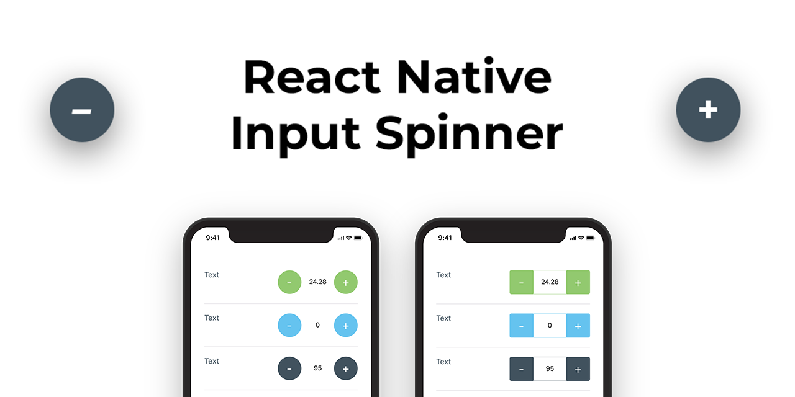
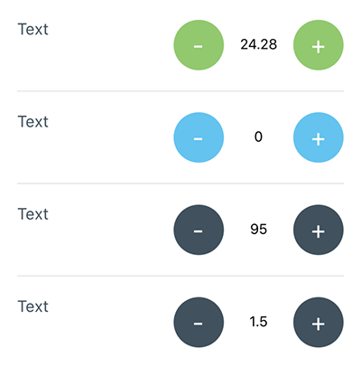
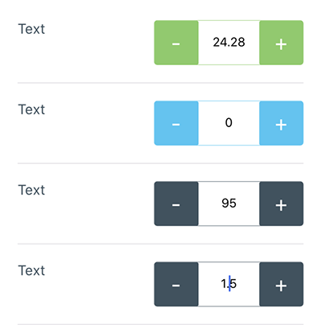
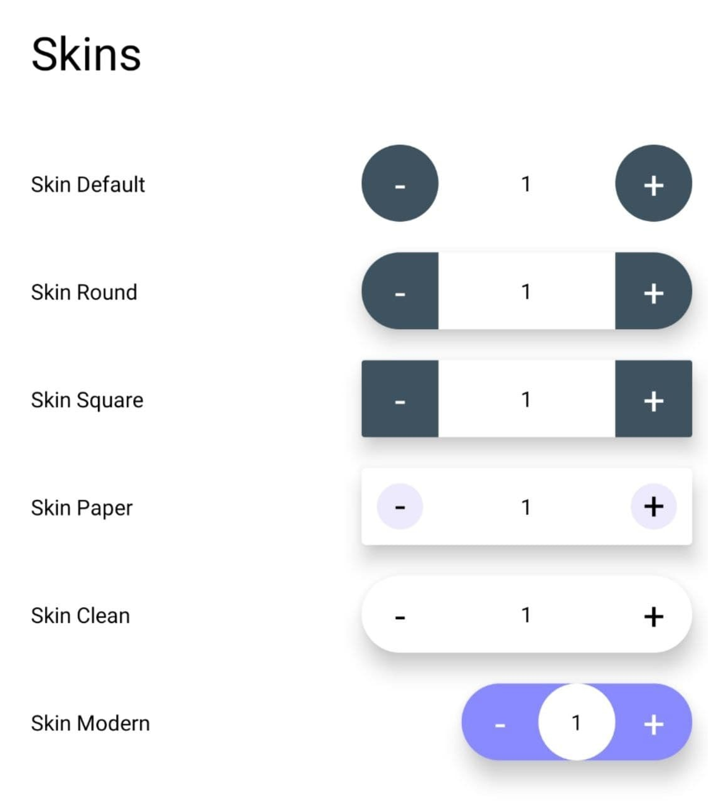
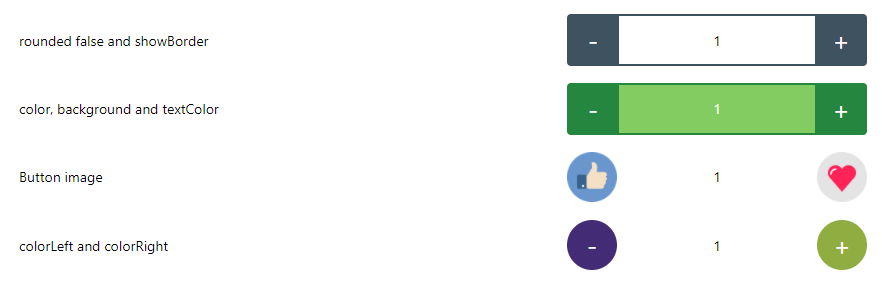
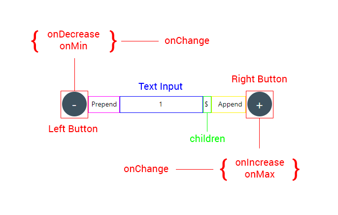
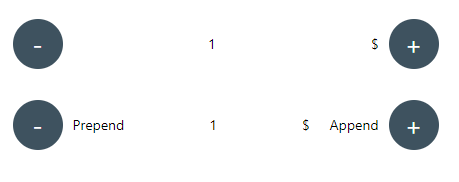
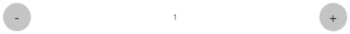

<div align="center">



### If this project has helped you out, please support us with a star 🌟

<br>

[](http://npmjs.org/package/react-native-input-spinner)
[](https://packagequality.com/#?package=react-native-input-spinner)
[](https://prettier.io/)
[](http://npmjs.org/package/react-native-input-spinner)

</div>

## 📘 Description

**Author:** Marco Cesarato

**Github:** https://github.com/marcocesarato/react-native-input-spinner

An extendible input number spinner component for react-native highly customizable.
This component enhance a text input for entering numeric values, with increase and decrease buttons.

Try it on the published demo web app: [https://marcocesarato.github.io/react-native-input-spinner/](https://marcocesarato.github.io/react-native-input-spinner/)

_Compatible with: Android, iOS, Windows, Web and Expo._

## 📖 Install

Install the library from npm or yarn just running one of the following command lines:

| npm                                             | yarn                                  |
| ----------------------------------------------- | ------------------------------------- |
| `npm install react-native-input-spinner --save` | `yarn add react-native-input-spinner` |

[](https://nodei.co/npm/react-native-input-spinner/)

## 💻 Usage

```javascript
import InputSpinner from "react-native-input-spinner";

// Example
<InputSpinner
	max={10}
	min={2}
	step={2}
	colorMax={"#f04048"}
	colorMin={"#40c5f4"}
	value={this.state.number}
	onChange={(num) => {
		console.log(num);
	}}
/>;
```

For more examples check the `Example` directory the `App.js` file

## 🎨 Screenshots

| Default props + Min & Max colors | Not rounded, showBorder, Min & Max colors |
| -------------------------------- | ----------------------------------------- |
|  |         |

### High customization

| Skins                                     | Customization                          |
| ----------------------------------------- | -------------------------------------- |
|  |  |

## ⚡️ Example

### Web

[https://marcocesarato.github.io/react-native-input-spinner/](https://marcocesarato.github.io/react-native-input-spinner/)

### Expo

Clone or download repo and after:

```shell
cd Example
yarn install # or npm install
expo start
```

Open Expo Client on your device. Use it to scan the QR code printed by `expo start`. You may have to wait a minute while your project bundles and loads for the first time.

[Example App Screenshot](images/example_app.png)

## 💡 Props

Check the "[Props List](PROPS.md)" file to have the complete list of component props ordered by name.

### Structure



### Handlers

| Handler           | Description                                                                   | Func                   |
| ----------------- | ----------------------------------------------------------------------------- | ---------------------- |
| `onBlur`          | Callback that is called when the text input is blurred.                       | (e) => { ... }         |
| `onChange`        | Callback that is called when the number of the Spinner change.                | (num) => { ... }       |
| `onDecrease`      | Callback that is called when decrease button is clicked get value decreased.  | (decreased) => { ... } |
| `onFocus`         | Callback that is called when the text input is focused.                       | (e) => { ... }         |
| `onIncrease`      | Callback that is called when increase button is clicked get value increased . | (increased) => { ... } |
| `onKeyPress`      | Callback that is called when a key is pressed.                                | (e) => { ... }         |
| `onLongPress`     | Callback that is called when holding the right or the left button             | Function               |
| `onMax`           | Callback that is called when max is reached get max number permitted.         | (max) => { ... }       |
| `onMin`           | Callback that is called when min is reached get min number permitted.         | (min) => { ... }       |
| `onSubmitEditing` | Callback that is called when the text input's submit button is pressed        | (e) => { ... }         |

### Props

| Property               | Description                                                                                                                    | Type             | Default | Note                              |
| ---------------------- | ------------------------------------------------------------------------------------------------------------------------------ | ---------------- | ------- | --------------------------------- |
| `accelerationDelay`    | Delay time before start the `onLongPress` event and increase or decrease and continually                                       | Number           | `750 `  |                                   |
| `append`               | Custom element before right button                                                                                             | Component        |         |                                   |
| `autoFocus`            | If `true`, focuses the input on `componentDidMount`.                                                                           |                  | `false` |                                   |
| `continuity`           | On min value is reached next decrease value will be the max value, if max is reached next increase value will be the min value | Boolean          | `false` |                                   |
| `disabled`             | Disable the Spinner or not                                                                                                     | Boolean          | `false` |                                   |
| `editable`             | Set if input number field is editable or not                                                                                   | Boolean          | `true`  |                                   |
| `emptied`              | Set if input can be empty                                                                                                      | Boolean          | `false` |                                   |
| `initialValue`         | Initial value of the Spinner                                                                                                   | String<br>Number | `0`     |                                   |
| `inputProps`           | Customized TextInput Component props                                                                                           | Object           | `null`  | Could overwrite other props       |
| `leftButtonProps`      | Customized left button (Touchable Component) props                                                                             | Object           | `null`  | Could overwrite other props       |
| `maxLength`            | Limits the maximum number of characters that can be entered.                                                                   | Number           |         |                                   |
| `max`                  | Max number permitted                                                                                                           | String<br>Number | `null`  |                                   |
| `min`                  | Min value permitted                                                                                                            | String<br>Number | `0`     |                                   |
| `placeholder`          | The string that will be rendered when text input value is equal to zero                                                        | String           | `null`  |                                   |
| `placeholderTextColor` | The text color of the placeholder string.                                                                                      | String           | `null`  |                                   |
| `precision`            | Max numbers permitted after comma                                                                                              | Integer          | `2`     |                                   |
| `prepend`              | Custom element after left button                                                                                               | Component        |         |                                   |
| `returnKeyLabel`       | Sets the return key to the label. Use it instead of `returnKeyType`.                                                           | String           |         |                                   |
| `returnKeyType`        | Determines how the return key should look. On Android you can also use `returnKeyLabel`                                        | String           |         |                                   |
| `rightButtonProps`     | Customized right button (Touchable Component) props                                                                            | Object           | `null`  | Could overwrite other props       |
| `selectTextOnFocus`    | If `true`, all text will automatically be selected on focus.                                                                   | Bool             | `false` |                                   |
| `selectionColor`       | The highlight and cursor color of the text input.                                                                              | String           | `null`  |                                   |
| `step`                 | Value to increment or decrement the current spinner value                                                                      | String<br>Number | `1`     |                                   |
| `longStep`             | Value to increment or decrement the current spinner value `onLongPress`                                                        | String<br>Number | `step`  |                                   |
| `speed`                | Speed acceleration ratio of increase or decrease `onLongPress`                                                                 | Number           | `7`     | (value from `1` to `10`)          |
| `buttonTextProps`      | Customized text button props                                                                                                   | Object           | `null`  |                                   |
| `typingTime`           | Time before debounce and trigger `onChange` event                                                                              | Number           | `750`   |                                   |
| `type`                 | Type of spinner                                                                                                                | String           | `int`   | Can be `int` or `real`/`float`... |
| `value`                | Controlled value of the Spinner                                                                                                | String<br>Number | `0`     |                                   |

#### Screenshots



##### Description

- Top spinner with a child
- Bottom spinner with `prepend` and `append`

### Props Styles

| Property           | Description                   | Type   | Default | Note                                          |
| ------------------ | ----------------------------- | ------ | ------- | --------------------------------------------- |
| `buttonPressStyle` | Button style on Pressed state | Object |         | Could overwrite other props                   |
| `buttonStyle`      | Button style                  | Object |         | Could overwrite other props                   |
| `inputStyle`       | Text Input style              | Object |         | Could overwrite other props                   |
| `skin`             | Skin layout                   | String |         | `clean`, `modern`, `paper`, `round`, `square` |
| `style`            | Container style               | Object |         | Could overwrite other props                   |

### Props Colors

| Property               | Description                                                | Type   | Default       | Note |
| ---------------------- | ---------------------------------------------------------- | ------ | ------------- | ---- |
| `background`           | Custom input text background color                         | String | `transparent` |
| `buttonPressTextColor` | Custom color of the button of the Spinner on Pressed state | String | Auto          |
| `buttonTextColor`      | Custom color of the label's button of the Spinner          | String | Auto          |
| `colorAsBackground`    | Use color as background                                    | Bool   | `false`       |
| `colorLeft`            | Custom color of the Spinner left button                    | String | `#3E525F`     |
| `colorMax`             | Custom color of the Spinner when reach max value           | String |               |
| `colorMin`             | Custom color of the Spinner when reach min value           | String |               |
| `colorPress`           | Custom color of the Spinner button on touch press          | String | `#3E525F`     |
| `colorRight`           | Custom color of the Spinner right button                   | String | `#3E525F`     |
| `color`                | Custom color of the Spinner                                | String | `#3E525F`     |
| `textColor`            | Custom input text number color                             | String | Auto          |

#### Screenshots



##### Description

- Spinner with `color`, `buttonTextColor`, `colorPress` and `buttonPressTextColor` custom colors

### Props Container Style

| Property     | Description                           | Type    | Default | Note                                             |
| ------------ | ------------------------------------- | ------- | ------- | ------------------------------------------------ |
| `height`     | Custom height of the Spinner          | Number  | `50`    |
| `shadow`     | Show container shadow                 | Boolean | `false` | Use with `background` like `background={"#FFF"}` |
| `showBorder` | Show the border of the Spinner or not | Boolean | `false` | Use with `rounded={false}`                       |
| `style`      | Container style                       | Object  |         | Could overwrite other props                      |
| `width`      | Custom width of the Spinner           | Number  | `150`   |

### Props Buttons Style

| Property                | Description                                                        | Type      | Default        | Note                        |
| ----------------------- | ------------------------------------------------------------------ | --------- | -------------- | --------------------------- |
| `activeOpacity`         | Opacity of underlay on pressed button                              | Number    | `0.85`         |
| `arrows`                | Labels on button will be (< and >) instead of (+ and -)            | Boolean   | `false`        |
| `buttonFontFamily`      | Custom fontFamily of buttons of the Spinner                        | String    | System Default |
| `buttonFontSize`        | Custom fontSize of buttons of the Spinner                          | Number    | `14`           |
| `buttonLeftDisabled`    | Disable left button                                                | Boolean   | `false`        |                             |
| `buttonLeftImage`       | Custom element on the button left of the spinner                   | Component |                | Could overwrite other props |
| `buttonLeftText`        | Custom text on the button left of the spinner                      | String    |                |
| `buttonPressLeftImage`  | Custom element on the button left of the spinner on pressed state  | Component |                | Could overwrite other props |
| `buttonPressRightImage` | Custom element on the button right of the spinner on pressed state | Component |                | Could overwrite other props |
| `buttonPressStyle`      | Button Style on Pressed state (Plus and Minus buttons)             | Object    |                |
| `buttonPressTextColor`  | Custom color of the button of the Spinner on Pressed state         | String    | `#FFFFFF`      |
| `buttonRightDisabled`   | Disable right button                                               | Boolean   | `false`        |                             |
| `buttonRightImage`      | Custom element on the button right of the spinner                  | Component |                | Could overwrite other props |
| `buttonRightText`       | Custom text on the button right of the spinner                     | String    |                |
| `buttonStyle`           | Button Style (Plus and Minus buttons)                              | Object    |                |
| `buttonTextColor`       | Custom color of the labels's button of the Spinner                 | String    | `#FFFFFF`      |
| `buttonPressTextStyle`  | Button Style on Pressed state (Plus and Minus buttons)             | Object    |                | Could overwrite other props |
| `buttonTextStyle`       | Button text Style state (Plus and Minus buttons)                   | Object    |                | Could overwrite other props |
| `rounded`               | Use circular button                                                | Boolean   | `true`         |

### Props Text Input Style

| Property     | Description                                        | Type   | Default        | Note                      |
| ------------ | -------------------------------------------------- | ------ | -------------- | ------------------------- |
| `background` | Custom input text background color                 | String | `transparent`  |
| `fontFamily` | Custom fontFamily of the text input of the Spinner | String | System Default |
| `fontSize`   | Custom fontSize of the text input of the Spinner   | Number | `14`           |
| `inputStyle` | Text Input style                                   | Object |                | Can overwrite other props |
| `textColor`  | Custom input text number color                     | String | `#000000`      |

## 🤔 How to contribute

Have an idea? Found a bug? Please raise to [ISSUES](https://github.com/marcocesarato/react-native-input-spinner/issues).
Contributions are welcome and are greatly appreciated! Every little bit helps, and credit will always be given.

<p align="center">
    <br>
    <a href="https://nodei.co/npm/react-native-input-spinner/" rel="nofollow">
        
    </a>
</p>
