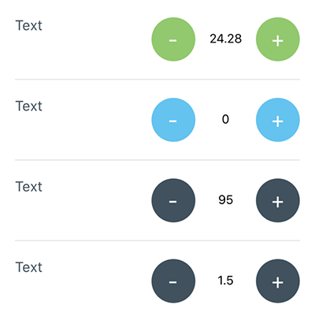

# React Native Input Spinner
### react-native-input-spinner

[![NPM version][npm-image]][npm-url]
[![npm download][download-image]][download-url]
[](http://standardjs.com/)

[npm-image]: http://img.shields.io/npm/v/react-native-input-spinner.svg?style=flat-square
[npm-url]: http://npmjs.org/package/react-native-input-spinner
[download-image]: https://img.shields.io/npm/dm/react-native-input-spinner.svg?style=flat-square
[download-url]: https://npmjs.org/package/react-native-input-spinner

**Github:** https://github.com/marcocesarato/react-native-input-spinner

**Author:** Marco Cesarato

## Description

An extendible input number spinner component for react-native.

This component enhance a text input for entering numeric values, with increase and decrease buttons.


## Install

### NPM
```shell
npm install react-native-input-spinner --save
```

### Yarn
```shell
yarn add react-native-input-spinner
```

## Usage

```javascript
// Require
include InputSpinner from 'react-native-input-spinner';

// Use
<InputSpinner
	max={10}
	min={2}
	value={this.state.number}
	onChange={(num)=>{console.log(num)}}
```

## Screenshot



## Props

Property          | Description | Type | Default | Note
------------------|-------------|------|---------|-------
max               | Max number permitted | Number | 0  |
min               | Min value permitted | Number | 99 |
type            | Type of spinner | Number | Int | Can be `float` or `int`
precision            | Max numbers permitted after comma | Integer | 2 |
offset            | Value to increment or decrement the current spinner value | Number | 1 |
value             | Controlled value of the Spinner | Number | 0 | If `value` is defined, then the value can change only via the property. This means that `onChange` must be defined and change external state. |
disabled          | Disable the Spinner or not | Boolean | false |
onChange       | Get the number of the Spinner | Function | |
width             | Custom width of the Spinner | Number | 150 |
height            | Custom height of the Spinner | Number | 50 |
style | Container style | Object |  |
buttonStyle | Button Style | Object |  |
inputStyle | InputStyle | Object |  |
color             | Custom color of the Spinner | String | ‘#3e525f' |
textColor          | Custom number color | String | ‘#000000' |
background        | Background color of number button | String | ’transparent' |
showBorder        | Show the border of the Spinner or not | Boolean | false |
fontSize          | Custom fontSize of the text input in the Spinner | Number | 14 |
buttonFontSize        | Custom fontSize of buttons in the Spinner | Number | 14 |
buttonTextColor   | Custom color of the button in the Spinner | String | 'white' |
