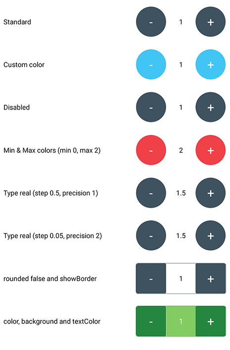

# React Native Input Spinner
### react-native-input-spinner

[![NPM version][npm-image]][npm-url]
[![npm download][download-image]][download-url]
[](http://standardjs.com/)

[npm-image]: http://img.shields.io/npm/v/react-native-input-spinner.svg?style=flat-square
[npm-url]: http://npmjs.org/package/react-native-input-spinner
[download-image]: https://img.shields.io/npm/dm/react-native-input-spinner.svg?style=flat-square
[download-url]: https://npmjs.org/package/react-native-input-spinner

**Github:** https://github.com/marcocesarato/react-native-input-spinner

**Author:** Marco Cesarato

## Description

An extendible input number spinner component for react-native.

This component enhance a text input for entering numeric values, with increase and decrease buttons.


## Install

### npm
```shell
npm install react-native-input-spinner --save
```

### Yarn
```shell
yarn add react-native-input-spinner
```

## Usage

```javascript
import InputSpinner from 'react-native-input-spinner';

// Example
<InputSpinner
	max={10}
	min={2}
	step={2}
	colorMax={"#f04048"}
	colorMin={"#40c5f4"}
	value={this.state.number}
	onChange={(num)=>{console.log(num)}}
```

## Run example
Clone or download repo and after:
```shell
cd Example
yarn install # or npm install
expo start
```

Open Expo Client on your device. Use it to scan the QR code printed by `expo start`. You may have to wait a minute while your project bundles and loads for the first time.

## Screenshots

Default props + Min & Max colors         | Not rounded, showBorder, Min & Max colors |
------------------|-------------|
       |  |

### Example app


## Handlers

Handler          | Description |
------------------|-------------|
onChange       | Get the number of the Spinner |
onMax       | When max is reached get max number permitted |
onMin       | When min is reached get min number permitted |
onIncrease       | When increase button is clicked get value increased |
onDecrease       | When decrease button is clicked get value decreased |

## Props

Property          | Description | Type | Default | Note
------------------|-------------|------|---------|-------
max               | Max number permitted | String<br>Number  | 0  |
min               | Min value permitted | String<br>Number  | 99 |
type            | Type of spinner | String | 'int' | Can be `real` or `int`
precision            | Max numbers permitted after comma | Integer  | 2 |
step            | Value to increment or decrement the current spinner value | String<br>Number   | 1 |
value             | Controlled value of the Spinner | String<br>Number | 0 | |
disabled          | Disable the Spinner or not | Boolean | false | |
editable          | Set if input number field is editable or not | Boolean | true | |

## Props style

Property          | Description | Type | Default | Note
------------------|-------------|------|---------|-------
style | Container style | Object |  | Can overwrite `width` and `showBorder` 
arrow | Labels on button will be arrows (< and >) instead of plus and minus | Boolean |  |  
width             | Custom width of the Spinner | Number | 150 | 
height            | Custom height of the Spinner | Number | 50 | 
activeOpacity     | Opacity on pressed button | Number | 0.85 | 
color             | Custom color of the Spinner | String | ‘#3e525f' | 
colorPress | Custom color of the Spinner button on touch press | String | ‘#3e525f' | 
colorRight             | Custom color of the Spinner right button | String | ‘#3e525f' | 
colorLeft             | Custom color of the Spinner left button | String | ‘#3e525f' | 
colorMin             | Custom color of the Spinner when reach min value | String | | 
colorMax             | Custom color of the Spinner when reach max value | String | | 
background        | Background color of number button | String | ’transparent' | 
rounded        | Use circular button | Boolean | true | 
showBorder        | Show the border of the Spinner or not | Boolean | false | Use with `rounded={false}` 
textColor          | Custom number color | String | ‘#000000' | 
inputStyle | Input Style (Text number at middle) | Object |  |
fontSize          | Custom fontSize of the text input in the Spinner | Number | 14 | 
buttonFontSize        | Custom fontSize of buttons in the Spinner | Number | 14 | 
buttonTextColor   | Custom color of the button in the Spinner | String | 'white' | 
buttonStyle | Button Style (Plus and Minus buttons) | Object |  |
