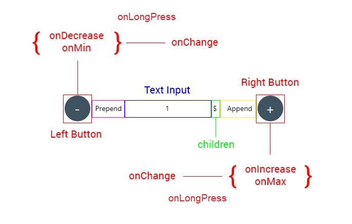

[![NPM version][npm-image]][npm-url]

[](https://packagequality.com/#?package=react-native-input-spinner)
[](https://prettier.io/)

[](https://nodei.co/npm/react-native-input=spinner/)

[npm-image]: http://img.shields.io/npm/v/react-native-input-spinner.svg?style=flat-square
[npm-url]: http://npmjs.org/package/react-native-input-spinner


**Github:** https://github.com/marcocesarato/react-native-input-spinner

**Author:** Marco Cesarato

### If this project has helped you out, please support us with a star 🌟

## 📘 Description

An extendible input number spinner component for react-native highly customizable.
This component enhance a text input for entering numeric values, with increase and decrease buttons.

*Compatible with: Android, iOS, Windows, Web and Expo.*

## 🎨 Screenshots

Default props + Min & Max colors         | Not rounded, showBorder, Min & Max colors |
------------------|-------------|
       |  |

### High customization


## 📖 Install

Just run the following command line:

### npm
```shell
npm install react-native-input-spinner --save
```

### Yarn
```shell
yarn add react-native-input-spinner
```

## 💻 Usage

```javascript
import InputSpinner from 'react-native-input-spinner';

// Example
<InputSpinner
	max={10}
	min={2}
	step={2}
	colorMax={"#f04048"}
	colorMin={"#40c5f4"}
	value={this.state.number}
	onChange={(num)=>{console.log(num)}}/>
```

For more examples check the `Example` directory the `App.js` file

## ⚡️ Run example
Clone or download repo and after:
```shell
cd Example
yarn install # or npm install
expo start
```

Open Expo Client on your device. Use it to scan the QR code printed by `expo start`. You may have to wait a minute while your project bundles and loads for the first time.

### Example app


## 💡 Props

Check the "[Props List](PROPS.md)" file to have the complete list of component props ordered by name.

### Structure
 

### Handlers

Handler          | Description | Func |
------------------|-------------|-------------|
`onChange`       | Get the number of the Spinner | (num) => { ... } |
`onMax`       | When max is reached get max number permitted |(max) => { ... } |
`onMin`       | When min is reached get min number permitted |(min) => { ... } |
`onIncrease`       | When increase button is clicked get value increased | (increased) => { ... } |
`onDecrease`       | When decrease button is clicked get value decreased | (decreased) => { ... } |

### Props

Property          | Description | Type | Default | Note
------------------|-------------|------|---------|-------
`value`             | Controlled value of the Spinner | String<br>Number | `0` | |
`type`            | Type of spinner | String | `int` | Can be `int` or `real`/`float`...
`step`            | Value to increment or decrement the current spinner value | String<br>Number   | `1` |
`max`               | Max number permitted | String<br>Number  | `0`  |
`min`               | Min value permitted | String<br>Number  | `99` |
`precision`            | Max numbers permitted after comma | Integer  | `2` |
`disabled`          | Disable the Spinner or not | Boolean | `false` | |
`editable`          | Set if input number field is editable or not | Boolean | `true` | |
`prepend`        | Custom element after left button | Component |  |
`append`        | Custom element before right button | Component |  |

#### Screenshots

 

##### Description
- Top spinner with a child
- Bottom spinner with `prepend` and `append`

### Props Styles

Property          | Description | Type | Default | Note
------------------|-------------|------|---------|-------
`style` | Container style | Object |  | Could overwrite other props
`inputStyle` | Text Input style | Object |  | Could overwrite other props
`buttonStyle` | Button style | Object |  | Could overwrite other props
`buttonPressStyle` | Button style on Pressed state | Object |  | Could overwrite other props

### Props Colors

Property          | Description | Type | Default | Note
------------------|-------------|------|---------|-------
`background`        | Custom input text background color | String | `transparent` | 
`textColor`          | Custom input text number color | String | `#000000` | 
`color`             | Custom color of the Spinner | String | `#3E525F` | 
`colorPress` | Custom color of the Spinner button on touch press | String | `#3E525F` | 
`colorRight`             | Custom color of the Spinner right button | String | `#3E525F` | 
`colorLeft`             | Custom color of the Spinner left button | String | `#3E525F` | 
`colorMin`             | Custom color of the Spinner when reach min value | String | | 
`colorMax`             | Custom color of the Spinner when reach max value | String | | 
`buttonTextColor`   | Custom color of the labels's button of the Spinner | String | `#FFFFFF` | 
`buttonPressTextColor`   | Custom color of the button of the Spinner on Pressed state | String | `#FFFFFF` | 

#### Screenshots
 

##### Description
- Spinner with `color`, `buttonTextColor`, `colorPress` and `buttonPressTextColor` custom colors

### Props Container Style

Property          | Description | Type | Default | Note
------------------|-------------|------|---------|-------
`style` | Container style | Object |  | Could overwrite other props
`width`             | Custom width of the Spinner | Number | `150` | 
`height`            | Custom height of the Spinner | Number | `50` | 
`showBorder`        | Show the border of the Spinner or not | Boolean | `false` | Use with `rounded={false}`

### Props Buttons Style

Property          | Description | Type | Default | Note
------------------|-------------|------|---------|-------
`buttonStyle` | Button Style (Plus and Minus buttons) | Object |  |
`arrows` | Labels on button will be (< and >) instead of (+ and -) | Boolean | `false`  | 
`rounded`        | Use circular button | Boolean | `true` | 
`activeOpacity`     | Opacity of underlay on pressed button | Number | `0.85` | 
`buttonLeftText`        | Custom text on the button left of the spinner | String |  | 
`buttonRightText`        | Custom text on the button right of the spinner | String |  | 
`buttonLeftImage`        | Custom element on the button left of the spinner | Component |  |  Could overwrite other props
`buttonRightImage`        | Custom element on the button right of the spinner | Component |  |  Could overwrite other props
`buttonPressLeftImage`        | Custom element on the button left of the spinner on pressed state | Component |  |  Could overwrite other props
`buttonPressRightImage`        | Custom element on the button right of the spinner on pressed state | Component |  |  Could overwrite other props
`buttonFontSize`        | Custom fontSize of buttons of the Spinner | Number | `14` | 
`buttonFontFamily`        | Custom fontFamily of buttons of the Spinner | String | System Default | 
`buttonTextColor`   | Custom color of the labels's button of the Spinner | String | `#FFFFFF` | 
`buttonPressStyle` | Button Style on Pressed state (Plus and Minus buttons) | Object |  |
`buttonPressTextColor`   | Custom color of the button of the Spinner on Pressed state | String | `#FFFFFF` | 

### Props Text Input Style

Property          | Description | Type | Default | Note
------------------|-------------|------|---------|-------
`inputStyle` | Text Input style | Object |  | Can overwrite other props
`textColor`          | Custom input text number color | String | `#000000` |
`background`        | Custom input text background color | String | `transparent` |  
`fontSize`          | Custom fontSize of the text input of the Spinner | Number | `14` | 
`fontFamily`          | Custom fontFamily of the text input of the Spinner | String | System Default |

## 🤔 How to contribute
Have an idea? Found a bug? Please raise to [ISSUES](https://github.com/marcocesarato/react-native-input-spinner/issues).
Contributions are welcome and are greatly appreciated! Every little bit helps, and credit will always be given.